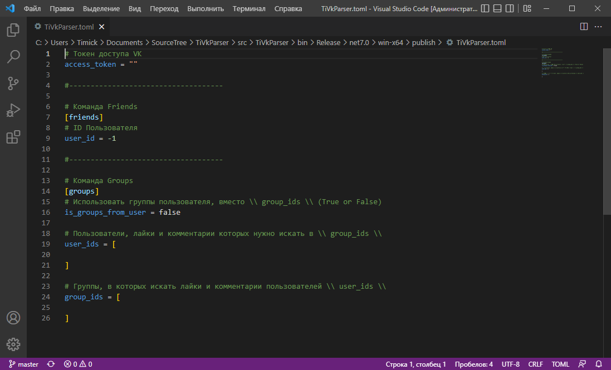

# TiVkParser
Приложение, для получения различных данных из соц. сети VK

# Функциональность
- [x] TiVkParser
  - [x] TiVkParser.Groups (Команда "groups")
    - [x] Получение лайков и комментариев пользователя в группах c последующим сохранением в Excel документ
  - [x] TiVkParser.Friends (Команда "Friends")
    - [x] Получение списка друзей пользователя и сохранение его в Excel документ

# Конфигурационный файл
```c#
# Токен доступа VK
access_token = ""

#------------------------------------

# Команда Friends
[friends]
# ID Пользователя
user_id = -1

#------------------------------------

# Команда Groups
[groups]
# Использовать группы пользователя, вместо \\ group_ids \\ (True or False)
is_groups_from_user = false

# Пользователи, лайки и комментарии которых нужно искать в \\ group_ids \\
user_ids = [
    
]

# Группы, в которых искать лайки и комментарии пользователей \\ user_ids \\
group_ids = [
    
]
```

# Скриншоты
### Главная


### Команда Friends


### Команда Groups


### Дефолтный конфигурационный файл


